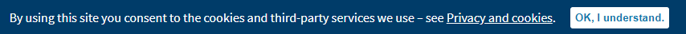

# Privacy banner

A privacy banner appears at the bottom of our website until you clear it. This is for GDPR compliance, to highlight our privacy and cookies policy and make it clear that further use of the website indicates consent to the terms of those policies. If consent is not granted, we expect people to use other methods to find out about council services such as phoning or visiting a library.

This works because `~\Escc.EastSussexGovUK.TemplateSource\MasterPages\Controls\ScriptsDesktop.ascx`, `~\Escc.EastSussexGovUK.TemplateSource\MasterPages\Controls\ScriptsFullScreen.ascx`, `~\Escc.EastSussexGovUK.TemplateSource\MasterPages\Controls\MetadataDesktop.ascx`, and `~\Escc.EastSussexGovUK.TemplateSource\MasterPages\Controls\MetadataFullScreen.ascx` include scripts and CSS with the token `Privacy`. These are included as part of every page that uses the sitewide design as part of the remote master page.

These are looked up in `web.config` by [Escc.ClientDependencyFramework.WebForms](https://github.com/east-sussex-county-council/Escc.ClientDependencyFramework) where it finds that the `Escc.EastSussexGovUK.ClientDependency` NuGet package defined in this repository has added entries for `Privacy` which point to `~\Escc.EastSussexGovUK.TemplateSource\js\privacy.js` and `~\Escc.EastSussexGovUK.TemplateSource\css\privacy.css`.

`privacy.js` then adds the banner to the page, unless it has already recorded in local storage that you have seen and closed the banner.